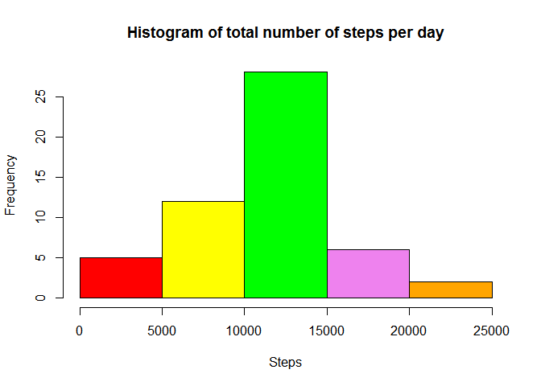
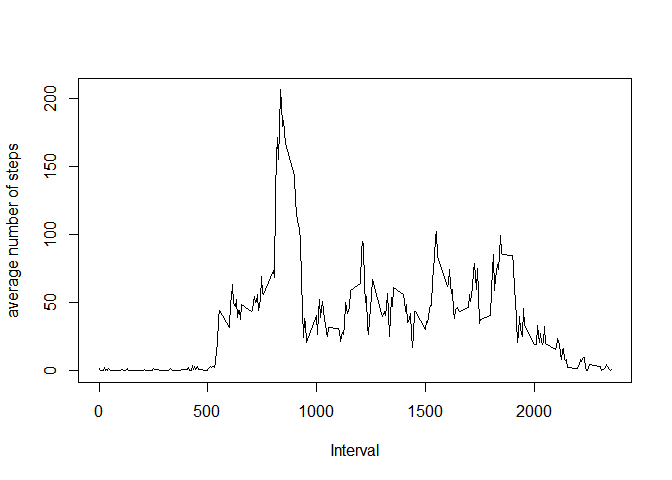
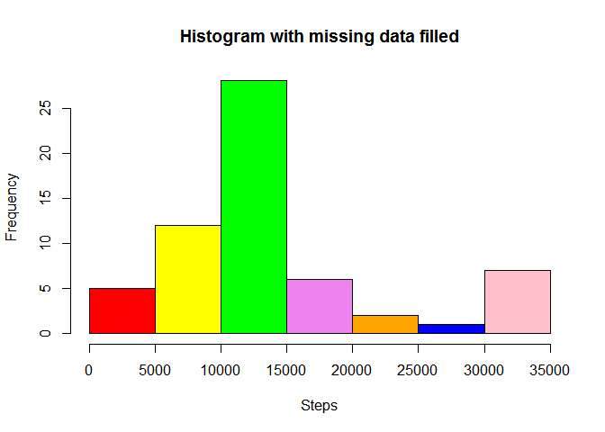
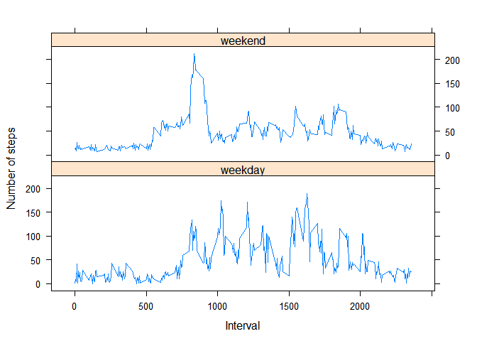

# Reproducible Research: Peer Assessment 1
Juan Paulo Salvador M.  
7 de febrero de 2016  


```
## [1] "LC_COLLATE=English_United States.1252;LC_CTYPE=English_United States.1252;LC_MONETARY=English_United States.1252;LC_NUMERIC=C;LC_TIME=English_United States.1252"
```

**Assignment**
==============

Loading and preprocessing the data
----------------------------------

**1. Load the data (i.e. read.csv())**


```r
## Download zip file
if(!file.exists("activity.zip")) {
    urlDataFile <- "https://d396qusza40orc.cloudfront.net/repdata%2Fdata%2Factivity.zip"
    download.file(urlDataFile,destfile = "activity.zip",method = "curl")
}
## unzip original activity.zip file if exists
if(file.exists("activity.zip")) {
    unzip("activity.zip") 
}
## read activity dataset
activity <- read.csv("activity.csv", header = TRUE, sep = ",")
```

**2. Process/transform the data (if necessary) into a format suitable for your analysis**

+ Add a new column converting each interval to the correspondin "HH:MM" format
+ Dataset are ordered by date and interval
+ November 29th tail 8 rows are shown


```r
## new column
activity$hhmm <- format(as.POSIXct(activity$interval * 60, origin = "1970-01-01", tz = "UTC"), "%H:%M")
## reorder by date and interval
activity <- activity[order(activity[,2], activity[,3]),]
## tail 8 rows
tail(activity[activity$date == "2012-11-29",], n = 8)
```

```
##       steps       date interval  hhmm
## 17273     0 2012-11-29     2320 14:40
## 17274     0 2012-11-29     2325 14:45
## 17275     0 2012-11-29     2330 14:50
## 17276     0 2012-11-29     2335 14:55
## 17277     0 2012-11-29     2340 15:00
## 17278     0 2012-11-29     2345 15:05
## 17279     0 2012-11-29     2350 15:10
## 17280     0 2012-11-29     2355 15:15
```

What is mean total number of steps taken per day?
-----------------------------------------------------

you can ignore the missing values in the dataset

**1. Calculate the total number of steps taken per day**


```r
## Aggregate total steps taken by day
## aggdata <- aggregate(x = list(activity$steps), by=list(date=as.Date(activity$date)), FUN=sum, na.rm=TRUE)
aggdata <- aggregate(steps ~ date, activity, sum, na.rm=TRUE)
## fix name of columns (for some reazon the date column name is corrupted)
colnames(aggdata) <- c("date", "steps")
## show the top 8 rows
head(aggdata, n=8)
```

```
##         date steps
## 1 2012-10-02   126
## 2 2012-10-03 11352
## 3 2012-10-04 12116
## 4 2012-10-05 13294
## 5 2012-10-06 15420
## 6 2012-10-07 11015
## 7 2012-10-09 12811
## 8 2012-10-10  9900
```


**2. If you do not understand the difference between a histogram and a barplot, research the difference between them. Make a histogram of the total number of steps taken each day**

According to wikipedia: "*A histogram is a graphical representation of the distribution of numerical data. It is an estimate of the probability distribution of a continuous variable (quantitative variable) . . .*"


```r
## build the histogram for totals
hist(aggdata$steps, main="Histogram of total number of steps per day", col=mycolors, xlab="Steps")
```



```r
## "garbage collector"
```

**3. Calculate and report the mean and median of the total number of steps taken per day**


```r
head(aggdata)
```

```
##         date steps
## 1 2012-10-02   126
## 2 2012-10-03 11352
## 3 2012-10-04 12116
## 4 2012-10-05 13294
## 5 2012-10-06 15420
## 6 2012-10-07 11015
```

```r
## mean
meanOfTotalStepsPerDay <- mean(aggdata$steps, na.rm = TRUE)
## median
medianOfTotalStepsPerDay <- median(aggdata$steps, na.rm = TRUE)
## "garbage collector"
aggdata <- NULL
```
+ <code>mean</code> = **1.0766189\times 10^{4}**

+ <code>median</code> = **10765**

What is the average daily activity pattern?
-------------------------------------------

**1. Make a time series plot (i.e. type = "l") of the 5-minute interval (x-axis) and the average number of steps taken, averaged across all days (y-axis)**


```r
## Aggregate media steps by interval just for complete cases
meandata2 <- aggregate(x = list(activity$steps), by=list(interval=activity$interval), FUN=mean, na.rm=TRUE)
## fix name of columns
colnames(meandata2) <- c("interval", "average.steps")
## plot the graphic
plot(meandata2$interval, meandata2$average.steps, type="l", xlab="Interval", ylab="average number of steps")
```



```r
## "garbage collector"
meandata2 <- NULL
```

**2. Which 5-minute interval, on average across all the days in the dataset, contains the maximum number of steps?**


```r
## Aggregate media steps by  just for complete cases
meandata2 <-aggregate(x = list(activity$steps), by=list(interval=activity$interval), FUN=mean, na.rm=TRUE)
## rename columns
colnames(meandata2) <- c("Interval", "average.steps")
## build and visualize results
maxAverage <- max(meandata2$average.steps)
intervalMaxAverage <- meandata2[which(meandata2$average.steps == maxAverage), ][1]
## "garbage collector"
meandata2 <- NULL
```

+ The interval with max average (206.1698113) is **835**


Imputing missing values
-----------------------

Note that there are a number of days/intervals where there are missing values (coded as NA). The presence of missing days may introduce bias into some calculations or summaries of the data.

**1. Calculate and report the total number of missing values in the dataset (i.e. the total number of rows with NAs)**


```r
missingValues <- dim(activity[!complete.cases(activity),])[1]
```

Total number of missing values: **2304**

**2. Devise a strategy for filling in all of the missing values in the dataset. The strategy does not need to be sophisticated. For example, you could use the mean/median for that day, or the mean for that 5-minute interval, etc.**

Strategy to inputting missig data:

- I will calculate the missing data for each day, so the results on Monday are diferent from Monday to Tuesday and so forth

- To calculate the missing data of eache weekday or weekaend I will implement **fillDay(activityDay)** function to will generate randomic dataset based en existing dataset "activityDay", first step is to get its max, min, mean and sd of valid "steps". I also get the number
of data to be generated (non valid "steps". Using all these calculated params I get the normal distribution (dnorm)
so I proceed to generate missing data that is used to fill the missing data.

- *I'm trying to be sophisticated ! . . . I'm not a mathematician and this is my very first time using dnorm ;)*

**3. Create a new dataset that is equal to the original dataset but with the missing data filled in.**


```r
## set seed, so another user can reproduce exactly the same data a same plots
set.seed(9876)
## add new column, weekdayname: "TRUE if it is MON, TUE, . . . FRIDAY; FALSE for SAT and SUN"Monday", "Tuesday", . ."
activity$weekdayname <- weekdays(as.Date(activity$date))
## Set dataset for each day of the week
activityMonday <- activity[activity$weekdayname == "Monday",]
activityTuesday <- activity[activity$weekdayname == "Tuesday",]
activityWednesday <- activity[activity$weekdayname == "Wednesday",]
activityThursday <- activity[activity$weekdayname == "Thursday",]
activityFriday <- activity[activity$weekdayname == "Friday",]
activitySaturday <- activity[activity$weekdayname == "Saturday",]
activitySunday <- activity[activity$weekdayname == "Sunday",]

## This function will generate randomic dataset based en existing dataset,
## what I'm doing is: on valid data I get max, min, mean, sd steps.
## Also get the number of data to be generate. Using this calculated params
## I get the normal distribution (dnorm) so a proceed to generate missing data
## that is used to fill the missing data
fillDay <- function(activityDay) {
    dayds <- activityDay
    ## get current max steps for complete cases data
    maxSteps <- max(dayds[complete.cases(dayds),]$steps)
    ## get current min steps for complete cases data
    minSteps <- min(dayds[complete.cases(dayds),]$steps)
    ## get current mean od steps for complete cases data
    meanSteps <- mean(dayds[complete.cases(dayds),]$steps)
    ## get current standar deviation steps for complete cases data
    sdSteps <- sd(dayds[complete.cases(dayds),]$steps)
    ## get the number of data to be filled
    genSteps <- length(dayds[!complete.cases(dayds),]$steps)
    ## calculate the normal distribution for data tobe generated, according to min, max, mean and
    ## standar deviation of the step for current complete cases data
    myprob <- dnorm(seq(minSteps, maxSteps, by = 1), mean = meanSteps, sd = sdSteps)
    ## gen the data
    gendata <- sample(seq(minSteps, maxSteps, by = 1), size=genSteps, replace=TRUE, prob=myprob)
    ## FILL MISSING DATA WITH GENERATED ONE !!!
    dayds[!complete.cases(dayds),]$steps <- gendata
    ## "garbage collector"
    myprob <- NULL
    gendata <- NULL
    ## return results
    return(dayds)
}

## for each day dataset it will be gendrated the missin data using the fillDay function
## in activity2 datase I will build the filled the new datase mantaining the original one
activity2 <- fillDay(activityMonday)
activity2 <- rbind(activity2, fillDay(activityTuesday))
activity2 <- rbind(activity2, fillDay(activityWednesday))
activity2 <- rbind(activity2, fillDay(activityThursday))
activity2 <- rbind(activity2, fillDay(activityFriday))
activity2 <- rbind(activity2, fillDay(activitySaturday))
activity2 <- rbind(activity2, fillDay(activitySunday))  ## activity2 This is the results !!

## "garbage collector"
activityMonday <- NULL
activityTuesday <- NULL
activityWednesday <- NULL
activityThursday <- NULL
activityFriday <- NULL
activitySaturday <- NULL
activitySunday <- NULL
```

**4. Make a histogram of the total number of steps taken each day and Calculate and report the mean and median total number of steps taken per day. Do these values differ from the estimates from the first part of the assignment? What is the impact of imputing missing data on the estimates of the total daily number of steps?**


```r
## Aggregate total step by date
aggdata2 <-aggregate(x = list(activity2$steps), by=list(date=as.Date(activity2$date)), FUN=sum, na.rm=FALSE)
## aggdata2 <- aggregate(steps ~ date, activity2, sum, na.rm=TRUE)
## fix name of columns (for some reazon the date column name is corrupted)
colnames(aggdata2) <- c("date", "steps")
## the histogram
hist(aggdata2$steps, main="Histogram with missing data filled", col=mycolors, xlab="Steps")
```



**Calculating the impact of imputed data**

The data inputed were build according to an specific strategy, as explained in point 3 So, it's assumed that at this point
that strategy will be evaluate when applying to data, looking the difference in mean, median, standar deviation, min and max.


```r
mean1   <- mean(activity$steps,    na.rm = TRUE)
mean2   <- mean(activity2$steps)
median1 <- medianOfTotalStepsPerDay
median2 <- trunc(median(aggdata2$steps))
meandiff <- 100 * (mean2 - mean1)/mean2
sd1     <- sd(activity$steps,      na.rm = TRUE)
sd2     <- sd(activity2$steps)
min1    <- min(activity$steps,     na.rm = TRUE)
min2    <- min(activity2$steps)
max1    <- max(activity$steps,     na.rm = TRUE)
max2    <- max(activity2$steps)
```

  data              | mean      | median      | standar deviation | min      | max 
:-----------------: | :-------: | :---------: | :---------------: | :------: | :------:
original            | 37.3825996 | 10765 | 111.9955329           | 0 | 806 
original + inputed  | 46.6815232 | 1.1458\times 10^{4} | 110.827089           | 0 | 806

+ There is a big (and unwanted) impact (19.9199233% difference) in the mean. It's unwanted because when the strategy whas applyied 
it was intended to keep almost the same mean, median, standar deviation, min and max measures in both, original an imputed data.

+ It's nice (no negative impact) on all ather measures: median (6.05% difference), standar deviation (1.04% difference), min and max; where the
original and imputed data arre identical or very close.

(At this point of the Data Science specialization I need more statistical theory to improve the way I fill missing data, hope the next course on 
**inferece** to get this background)

Are there differences in activity patterns between weekdays and weekends?
-------------------------------------------------------------------------

For this part the weekdays() function may be of some help here. Use the dataset with the filled-in missing values for this part.

1. Create a new factor variable in the dataset with two levels *weekday* and *weekend* indicating whether a given date is a weekday or weekend day.


```r
## add new column, weekday: TRUE if it is MON, TUE, . . . FRIDAY; FALSE for SAT and SUN
activity2$typeday <- factor(weekdays(as.Date(activity2$date)) %in% c("Monday","Tuesday","Wednesday","Thursday","Friday","Saturday"), labels = c("weekday", "weekend"))
```

2. Make a panel plot containing a time series plot (i.e. type = "l") of the 5-minute interval (x-axis) and the average number of steps taken, averaged across all weekday days or weekend days (y-axis). See the README file in the GitHub repository to see an example of what this plot should look like using simulated data.


```r
aggdata3 <- aggregate(x=list(activity2$steps), by=list(date=activity2$typeday, typeday=activity2$interval), FUN=mean )
colnames(aggdata3) <- c("typeday","interval","average.steps")
xyplot(average.steps ~ interval | typeday, data = aggdata3, type="l", layout = c(1, 2), ylab="Number of steps", xlab="Interval")
```



**Calculating the difference**

Just compare mean and sd, differences on 5% or less considered not big difference, more than 5% but less 15% medium diffrence,
more than 15% big difference (not shure if this is this is the best point of view)


```r
weekdays <- aggdata3[which(aggdata3$typeday == "weekday"),]
weekends <- aggdata3[which(aggdata3$typeday == "weekend"),]
meanweekdays <- mean(weekdays$average.steps)
meanweekends <- mean(weekends$average.steps)
meandiff <- abs(meanweekdays - meanweekends)
sdweekdays   <- sd(weekdays$average.steps)
sdweekends   <- sd(weekends$average.steps)
sddiff <- abs(sdweekdays - sdweekends)
if(meandiff <= 5) {
  meanmsg <- 'minor difference'
} else
if(meandiff > 5 & meandiff <= 15) {
  meanmsg <- 'medium difference'
} else {
  meanmsg <- 'big difference'
}

if(sddiff <= 5) {
  sdmsg <- 'minor difference'
} else
if(sddiff > 5 & sddiff <= 15) {
  sdmsg <- 'medium difference'
} else {
  sdmsg <- 'big difference'
}
```

+ Diference in mean measure = **4.2394933%**, it's a **minor difference**

+ Diference in seviation standar measure = **7.4678912%**, it's a **medium difference**


.

.

.

Report developed by Juan Paulo Salvador

cheers !
